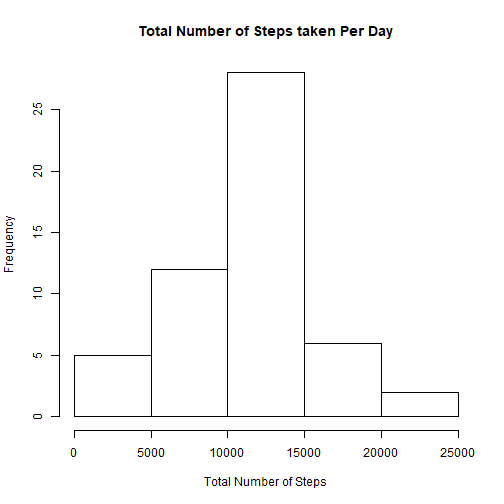
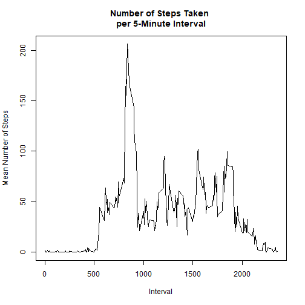
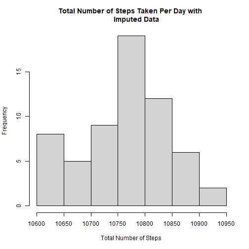
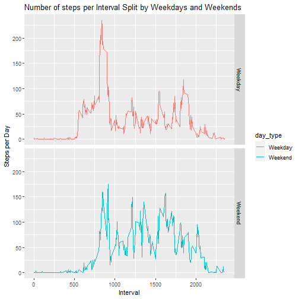

## Loading and preprocessing the data
In this step, we will load the data and process/transform it as needed
for analysis.


```r
## Load and read the data
data <- read.csv("activity.csv", header = TRUE)
## Determine if there is missing data and place into own data frame
dim(data)
```

```
## [1] 17568     3
```

```r
missingData <- data[is.na(data$steps),]
```

## What is mean total number of steps taken per day?
For this next step we will do the following:

1. Calculate the total number of steps taken per day

2. Make a histogram of the total number of steps taken each day.

3. Calculate and report the mean and median of the total number of steps taken 
per day

During these steps, we will be ignoring the missing values within the data set.


```r
## Determine the non-missing data points and put them in their own data frame
completeData <- data[!is.na(data$steps),]
## Read data frame column names for use later
names(completeData)
```

```
## [1] "steps"    "date"     "interval"
```

```r
## (1) Calculate the total number of steps taken per day
stepsPerDay <- with(completeData, tapply(steps, as.factor(completeData$date)
                                         ,sum))

## (2) Make the histogram of total steps per day.
hist(stepsPerDay, main = "Total Number of Steps taken Per Day", 
     xlab = "Total Number of Steps", col = "White")
```



```r
## (3) Mean and median number of steps
summary(stepsPerDay)
```

```
##    Min. 1st Qu.  Median    Mean 3rd Qu.    Max. 
##      41    8841   10765   10766   13294   21194
```

```r
meanSPD <- mean(stepsPerDay)
## Format for return
meanSPDTrunc <- trunc(meanSPD)
meanSPDInt <- as.integer(meanSPDTrunc)
medianSPD <- median(stepsPerDay)
```
**Given the total number of steps per day data, the mean is 10766 
and the median is 10765.**

## What is the average daily activity pattern?
Now we will do the following:

1. Make a time series plot (type = "l") of the 5-minute interval (x-axis) and 
the average number of steps taken, across all days (y-axis).

2. Determine which 5-minute interval, on average across all the days in the data
set, contains the max number of steps.


```r
## (1) Plot mean steps across each interval
## Break data into 5-minute intervals
meanStepsInterval <- with(completeData, tapply(steps, completeData$interval, 
                                               mean))
intervals <- levels(as.factor(completeData$interval))
## Plot the mean number of steps per interval
plot(intervals, meanStepsInterval, type ="l", main = "Number of Steps Taken 
per 5-Minute Interval", xlab = "Interval", ylab = "Mean Number of Steps")
```



```r
## (2) Find max number of steps from all the intervals
maxSteps <- data.frame(meanStepsInterval, intervals)
max <- maxSteps[maxSteps$meanStepsInterval==max(maxSteps$meanStepsInterval),][2]
numMax <- max(maxSteps$meanStepsInterval)
```
**The interval with the max number of steps is 835 with an average value of 
206.1698113.**

## Imputing missing values
Within the data we have received, there are some missing values, represented as 
NA. These missing values will introduce biases into the calculations of the 
data summaries.Next, we will do the following steps:

1. Calculate and return the total number of missing values within the data set.

2. Devise a strategy for filling in the missing values of the data set.

3. Create a new data set that is equal to the original data set, but with the 
missing data filled in.

4. Make a histogram with the total number of steps taken each day, and then 
calculate and return the mean and median total number of steps taken per day. 
From this data, we will determine which values differ from the estimates from 
the first part of the assignment. We will also determine the impact of imputing 
missing data on the estimates of the total daily number of steps.


```r
## (1) Calculate number of missing data values
numMissing <- length(missingData$steps)
```
**The number of missing values within the data set is 2304.**

**(2) In order to fill in missing data, I have chosen to fill the vacancies 
with the average number of steps taken for that specific day when the vacancies 
are found..**

```r
## (3) Create and fill in the missing data
imputedData <- data
meanSteps <- with(completeData, tapply(steps, completeData$date, mean))
for(i in 1:nrow(data)){
    if(is.na(imputedData$steps[i])){
        imputedData$steps[which(imputedData$interval == data$interval)] <- 
            meanSteps
    }
}
```

```
## Warning in imputedData$steps[which(imputedData$interval == data$interval)]
## <- meanSteps: number of items to replace is not a multiple of replacement
## length
```

```r
imputedStepsPerDay <- with(imputedData, tapply(steps, 
        as.factor(imputedData$date), sum))

## (4) Make a histogram of the new data and return the mean and median of the 
## new data set. Determine which values differ from the original set. Analyze 
## the impact of filling in missing data given the method used to do so.
hist(imputedStepsPerDay, main = "Total Number of Steps Taken Per Day with 
     Imputed Data",
    xlab = "Total Number of Steps")
```



```r
summary(imputedStepsPerDay)
```

```
##    Min. 1st Qu.  Median    Mean 3rd Qu.    Max. 
##   10612   10731   10773   10766   10811   10913
```

```r
## Format for return
medianImputed <- median(imputedStepsPerDay)
medianImputedInt <- as.integer(medianImputed)
meanImputed <- mean(imputedStepsPerDay)
meanImputedTrunc <- trunc(meanImputed)
meanImputedInt <- as.integer(meanImputedTrunc)
```
**After imputed the missing data into the table, you can see that the mean has 
not changed and is still 10766, but the median has slightly changed 
from 10765 to a new value of 10772.**

## Are there differences in activity patterns between weekdays and weekends?
Finally we will complete the following.

1. Create a new factor variable in the data set with two levels, "weekday" and
"weekend", to distinguish which data corresponds to a weekdays and weekends.

2. Make a panel plot containing a time series plot (type = "l") of the 5-minute
interval (x-axis) and the number of average number of steps taken, averaged 
across all weekday days or weekend days (y-axis). 


```r
## (1) New factor variable column added to data set
weekDay <- function(date_val) {
    day <- weekdays(as.Date(date_val, '%Y-%m-%d'))
    if(!(day == 'Saturday' || day == 'Sunday')){
        type <- 'Weekday'
    } else {
        type <- 'Weekend'
    }
}
data$day_type <- as.factor(sapply(data$date, weekDay))
imputedStepsPerDay <- aggregate(steps ~ interval + day_type, data, mean)

## (2) Plot steps per interval split by weekday and weekend days
library(ggplot2)

weekDayPlot <- ggplot(imputedStepsPerDay, aes(interval, steps)) +
    geom_line(stat = "identity", aes(color = day_type)) + theme_gray() +
    facet_grid(day_type ~ ., scales = "fixed", space = "fixed") +
    labs(x = "Interval", y = expression("Steps per Day")) +
    ggtitle("Number of steps per Interval Split by Weekdays and Weekends")
print(weekDayPlot)
```


